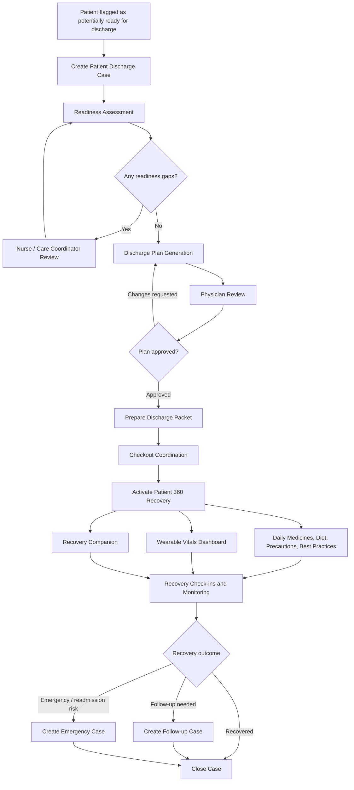
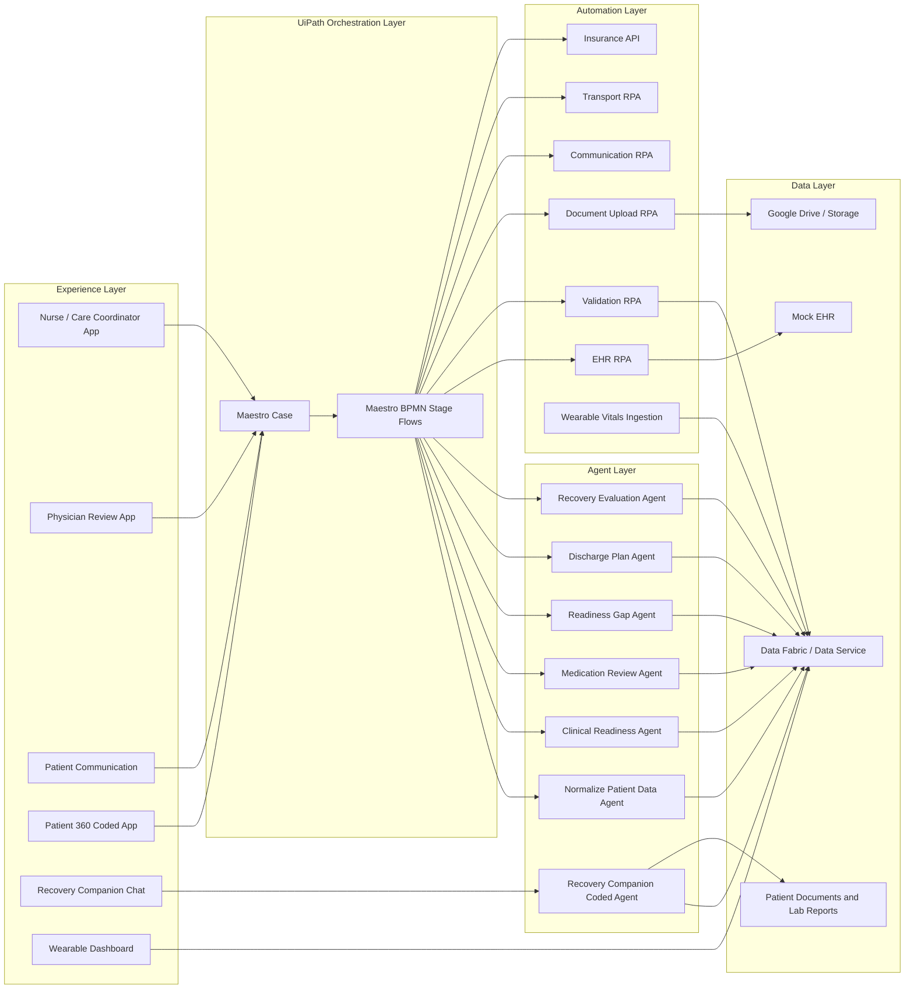

# CareBridgeAI
The Intelligent Patient Discharge Case System is a UiPath-powered healthcare automation solution designed to support providers and patients through one of the most important transitions in their care journey to help Patient recover soon.

# CareBridge AI

> **An intelligent patient discharge and recovery case system built with UiPath Maestro Case, Maestro BPMN, Agent Builder, Coded Apps, Coded Agents, RPA, APIs, and human-in-the-loop governance.**

CareBridge AI helps hospitals manage one of the most fragile moments in healthcare: the transition from hospital to home. It orchestrates the full discharge journey from readiness assessment to discharge plan approval, checkout coordination, guided recovery, patient 360 visibility, wearable-enabled monitoring, recovery companion support, and case closure.

This project was built for **UiPath AgentHack 2026** under **Track 1: UiPath Maestro Case**.

---

## The Big Idea

Most discharge solutions stop when the patient leaves the hospital.

**CareBridge AI does not.**

It treats discharge as the beginning of a new recovery journey, not the end of hospital work. The solution supports both sides of the transition:

| Stakeholder | What CareBridge AI gives them |
|---|---|
| **Hospital teams** | A governed Maestro Case lifecycle for discharge readiness, clinical gaps, plan approval, checkout, transport, recovery monitoring, and closure. |
| **Nurses and care coordinators** | A clear case view of gaps, tasks, patient readiness, medication issues, insurance/auth blockers, discharge status, and recovery outcomes. |
| **Physicians** | A structured discharge plan review flow where AI drafts but the physician approves. |
| **Patients** | A Patient 360 recovery experience showing daily medications, diet guidance, precautions, best practices, recovery reminders, wearable vitals, and a grounded recovery companion. |
| **Caregivers** | Clear instructions and support so the patient does not feel lost after leaving the hospital. |

The heart of the project is simple:

> **The hospital should not only discharge the patient. It should help the patient recover safely after discharge.**

---

## Why CareBridge AI Matters

Patient discharge is not a simple checklist. It is a long-running, exception-heavy journey involving physicians, nurses, case managers, pharmacists, payers, transport teams, caregivers, documents, medications, follow-ups, and post-discharge recovery signals.

Today, discharge coordination is often fragmented across EHR notes, calls, emails, spreadsheets, portals, documents, and manual handoffs. That creates delays for hospitals and confusion for patients.

But the biggest burden often starts **after** discharge.

A patient may go home with a discharge packet, new medications, diet changes, activity restrictions, follow-up instructions, warning signs, and emotional stress. During recovery, even a small unanswered question can create anxiety. A missed medication, unclear symptom, or delayed escalation can become a preventable issue.

CareBridge AI is designed to reduce that burden.

It makes sure:

- The care team sees discharge readiness gaps early.
- AI agents summarize and recommend, while humans approve clinical decisions.
- Robots handle repeatable system work.
- The discharge plan is converted into a patient-friendly recovery experience.
- The patient has a daily recovery view after going home.
- Smart wearable data can be integrated for vitals visibility and analytics.
- A grounded recovery companion can answer patient questions using approved patient documents.
- Emergency or worsening recovery signals can create a linked escalation case.
- Every step remains visible, auditable, and governed inside UiPath Maestro Case.

---

## What It Does

CareBridge AI creates one **Patient Discharge Case** per patient. The case acts as the single governing entity for data, stages, ownership, status, human approvals, agent outputs, patient recovery activity, escalations, and closure.

The system supports the full journey:

1. **Create discharge case** when the patient is nearing discharge readiness.
2. **Retrieve and normalize patient data** from the mock EHR.
3. **Validate patient records, insurance snapshot, and clinical readiness.**
4. **Identify readiness gaps** such as medication reconciliation, missing documents, payer/auth issues, or clinical blockers.
5. **Generate a readiness summary** for the care team.
6. **Generate a draft discharge plan** using patient data, documents, lab reports, medications, and provider recommendations.
7. **Route plan to physician review** before finalization.
8. **Prepare the discharge packet** and upload artifacts to Google Drive or storage.
9. **Send discharge communication** to the patient/caregiver.
10. **Coordinate transport and complete checkout.**
11. **Activate Patient 360 recovery support.**
12. **Show daily medicines, diet, precautions, best practices, and recovery tasks.**
13. **Integrate wearable vitals** from Apple Watch or other smart devices into a recovery dashboard.
14. **Use a Recovery Companion coded agent** grounded on patient-specific documents.
15. **Evaluate recovery status** and create follow-up or emergency cases when needed.
16. **Close the original discharge case** with a documented outcome.

---

## The Breakthrough: Patient 360 Recovery System

The strongest differentiator in CareBridge AI is the recovery-side experience.

CareBridge AI is not only a provider workflow. It is also a **patient recovery operating layer**.

After discharge, the patient gets access to a **Patient 360 system built using UiPath Coded Apps**. This gives the patient and care team one place to understand the recovery journey.

### Patient 360 includes

| Module | Description |
|---|---|
| **Daily Medicine View** | Shows what medicines the patient should take, dosage, timing, and medication reminders. |
| **Diet Guidance** | Displays diet instructions from the discharge plan, such as low-sodium, diabetic, fluid restriction, or cardiac diet guidance. |
| **Precautions** | Shows patient-specific restrictions, warning signs, fall precautions, activity limitations, and when to call the provider. |
| **Best Practices** | Provides simple recovery tips based on the approved plan, such as hydration, walking guidance, rest, wound care, monitoring symptoms, and follow-up discipline. |
| **Recovery Tasks** | Gives the patient a daily checklist of care actions, appointments, check-ins, and reminders. |
| **Wearable Vitals Dashboard** | Displays vitals and activity signals from smart wearable devices such as Apple Watch or other compatible devices. |
| **Recovery Status Analytics** | Uses check-ins and wearable signals to understand whether the patient is improving, stable, needs follow-up, or may require escalation. |
| **Recovery Companion** | A conversational coded agent that answers patient questions using the patient’s discharge plan, lab reports, documents, and approved instructions. |

This is where CareBridge AI moves beyond discharge automation and becomes a recovery support system.

---

## Recovery Companion: Grounded Conversational Agent

The **Recovery Companion** is a conversational agent built using a UiPath coded agent pattern.

It is designed to answer patient recovery questions using patient-specific context, not generic internet-style responses.

### Context used by the companion

- Approved discharge plan
- Patient discharge packet
- Medication list
- Lab reports
- Clinical notes or uploaded patient documents
- Recovery instructions
- Diet and activity guidance
- Follow-up appointment details
- Patient-specific warning signs
- Historical check-ins

### Example questions the patient can ask

- “When should I take my medicines today?”
- “Can I climb stairs?”
- “What food should I avoid?”
- “Is this symptom mentioned in my discharge instructions?”
- “When is my follow-up appointment?”
- “What warning signs should I watch for?”
- “I feel dizzy after taking my medication. What should I do?”

### Safety behavior

The Recovery Companion is intentionally designed with strict escalation behavior.

It can explain approved discharge instructions, but it does not replace a clinician.

If the patient reports a concerning symptom, out-of-scope medical question, worsening condition, or uncertainty, the agent flags the concern and routes the case to the care team.

> **The companion supports recovery clarity. It does not make independent clinical decisions.**

---

## Smart Wearable Integration

CareBridge AI includes a module that can integrate with smart wearable devices and show recovery indicators inside the Patient 360 dashboard.

For the hackathon demo, the wearable feed can be simulated or connected through exported health data. The architecture is designed so the same pattern can later support real integrations.

### Supported wearable concept

| Source | Example data |
|---|---|
| **Apple Watch / iPhone Health data** | Heart rate, steps, activity, SpO2 where available, trends, and timestamped health indicators. |
| **Other smart wearables** | Any device capable of exporting or exposing vitals/activity data through API, CSV, or integration layer. |
| **Manual check-ins** | Pain level, symptoms, medication taken, appetite, breathing status, dizziness, fatigue, and patient concerns. |

### How the data is used

- Display recovery trends in the Patient 360 dashboard.
- Compare current signals against the patient’s risk profile.
- Support recovery analytics and progress tracking.
- Help the care team identify deterioration earlier.
- Trigger follow-up or emergency escalation when signals become concerning.

For the demo, this creates a powerful story:

> **Critical Carl leaves the hospital, but recovery monitoring continues. When vitals or check-ins become concerning, Maestro does not wait for the case to be manually discovered. It creates a linked emergency/readmission case and alerts the care team.**

---

## Solution Overview

CareBridge AI combines provider-side case management and patient-side recovery support into one governed system.

| Capability | How it is used |
|---|---|
| **UiPath Maestro Case** | Governs the long-running discharge and recovery lifecycle. |
| **Maestro BPMN** | Runs deterministic stage flows such as case creation, readiness assessment, checkout, recovery, and closure. |
| **UiPath Agent Builder** | Performs judgment-heavy tasks such as readiness gap assessment, medication review, discharge plan drafting, and recovery evaluation. |
| **UiPath Coded Apps** | Powers the Patient 360 recovery system and interactive care-team/patient experience. |
| **UiPath Coded Agents** | Powers the Recovery Companion conversational agent and structured patient-specific recovery support. |
| **UiPath RPA** | Retrieves mock EHR data, validates patient records, sends communication, prepares packets, uploads documents, and coordinates transport. |
| **UiPath Apps / Action Center** | Keeps nurses, physicians, and care coordinators in control at approval and review points. |
| **Data Fabric / Data Service** | Stores patient, case, checklist, discharge plan, vitals, check-in, and recovery outcome data. |
| **Google Drive / Storage** | Stores generated discharge packets, patient artifacts, and recovery documents. |
| **Integration/API layer** | Supports insurance snapshot checks, communication, document retrieval, and wearable data ingestion. |

---

## Why UiPath Maestro Case Is the Right Fit

Patient discharge is not a fixed linear process. Different patients take different paths:

- Some are ready with no gaps.
- Some need medication reconciliation.
- Some need insurance authorization.
- Some need transport coordination.
- Some need more education before leaving.
- Some need daily recovery reminders.
- Some need wearable monitoring.
- Some ask recovery questions after going home.
- Some show worsening symptoms and need urgent escalation.
- Some recover successfully and can be closed.
- Some require a follow-up or readmission case.

This makes it a perfect use case for **agentic case management**.

CareBridge AI uses Maestro Case for the overall lifecycle and BPMN flows for structured stage execution. This gives the solution both flexibility and control.

---

## End-to-End Lifecycle



---

## Case Stages

| Stage | Purpose | Main UiPath Components |
|---|---|---|
| **1. Case Creation** | Create the discharge case when the patient is nearing discharge readiness. | Maestro Case, BPMN, RPA, API |
| **2. Readiness Assessment** | Validate patient data, documents, medication status, clinical readiness, and insurance/auth blockers. | BPMN, Agents, RPA, App/User Review |
| **3. Discharge Plan Generation** | Generate a structured discharge plan using patient data, readiness summary, and provider recommendations. | Agent Builder, BPMN, App/User Review, Google Drive |
| **4. Checkout Coordination** | Prepare the patient packet, send communication, coordinate transport, and complete checkout. | BPMN, RPA, Communication workflow |
| **5. Patient 360 Guided Recovery** | Give the patient daily recovery visibility, reminders, wearable dashboard, check-ins, and companion support. | Coded App, Coded Agent, BPMN, Data Service, APIs |
| **6. Recovery Closure** | Decide whether the patient recovered, needs follow-up, or requires emergency escalation. | BPMN, Agent, linked case creation |

---

## Digitized UiPath Components

| Component | Type | Purpose |
|---|---|---|
| `Maestro Case` | Maestro Case | Governing patient discharge case container. |
| `Create Discharge Case Record` | Maestro BPMN | Creates and initializes the discharge case record. |
| `RetrievePatientDataFromEHR` | RPA | Retrieves mock patient data from the EHR source. |
| `NormalizePatientData` | Agent | Normalizes patient information into a consistent structure. |
| `ValidatePatientData` | RPA | Validates required patient, admission, provider, and contact fields. |
| `VerifyInsuranceSnapshot` | API | Checks payer snapshot and basic insurance status. |
| `Read Patient Documents` | Maestro BPMN | Reads patient-related documents and artifacts. |
| `ValidateClinicalReadinessAgent` | Agent | Evaluates clinical readiness indicators. |
| `MedicationReviewAgent` | Agent | Reviews medication reconciliation status and medication gaps. |
| `Review Insurance and Auth` | RPA | Reviews payer or authorization dependency. |
| `MedicalGapReadinessAgent` | Agent | Identifies gaps blocking discharge readiness. |
| `GenerateReadinessSummary` | Agent | Summarizes readiness outcome and unresolved gaps. |
| `GenerateDraftDischargePlan` | Agent | Generates the draft discharge plan. |
| `Review Patient Plan` | App | Allows physician/human review and approval. |
| `PrepareDischargePacket_BPMN` | Maestro BPMN | Prepares the discharge packet. |
| `FetchDocumentAndUploadtoGDrive` | RPA | Uploads generated artifacts to Google Drive. |
| `SendCommunication` | RPA | Sends discharge communication to patient/caregiver. |
| `Co-ordinate Transport` | Maestro BPMN | Coordinates patient transportation. |
| `CompleteCheckout` | RPA | Completes the checkout process. |
| `ActivatePatientRecovery` | Maestro BPMN | Activates Patient 360 guided recovery support. |
| `SendRecoveryReminders` | Maestro BPMN | Sends medication, care, and follow-up reminders. |
| `CaptureCheckIn` | Maestro BPMN | Captures patient check-in responses. |
| `Review Recovery Outcome` | Maestro BPMN | Reviews recovery progress and outcome. |
| `CompleteClosure` | Maestro BPMN | Closes the discharge case with final outcome. |
| `Patient360RecoveryApp` | UiPath Coded App | Patient-facing recovery dashboard for daily care guidance and wearable insights. |
| `RecoveryCompanionAgent` | UiPath Coded Agent | Grounded conversational support using patient documents and discharge context. |
| `WearableVitalsIngestion` | API / Workflow | Ingests simulated or exported wearable data into recovery analytics. |

---

## Agent Design

CareBridge AI uses narrow, purpose-built agents. Each agent has a focused role, structured inputs, structured outputs, and a clear escalation policy.

### 1. Normalize Patient Data Agent

**Purpose:** Converts raw patient JSON or EHR-style data into a clean, standardized structure.

**Output:**

```json
{
  "normalized": true,
  "patientId": "PAT-1002",
  "missingFields": [],
  "dataQualityNotes": []
}
```

---

### 2. Clinical Readiness Agent

**Purpose:** Reviews patient readiness indicators and determines whether any clinical blocker exists.

**Checks include:**

- Clinical stability
- Pending labs or consults
- Provider readiness
- Diagnosis-specific concerns
- Risk level

**Escalation:** Any unclear or high-risk clinical item is routed to human review.

---

### 3. Medication Review Agent

**Purpose:** Reviews medication reconciliation status and identifies medication-related discharge blockers.

**Checks include:**

- Medication reconciliation complete or pending
- New, changed, stopped medications
- Allergy conflicts
- High-risk medication education needs
- Pharmacy/access concerns

**Escalation:** Medication gaps are routed to nurse/pharmacy review.

---

### 4. Medical Gap Readiness Agent

**Purpose:** Consolidates patient data, clinical readiness, medication status, insurance/auth status, and document status into a readiness decision.

**Output:**

```json
{
  "readyForDischargePlanning": false,
  "riskLevel": "Medium",
  "gaps": [
    {
      "category": "Medication",
      "gap": "Medication reconciliation is not complete",
      "owner": "Pharmacy",
      "priority": "High"
    }
  ],
  "recommendation": "Pause discharge plan generation until medication reconciliation is reviewed."
}
```

---

### 5. Discharge Plan Agent

**Purpose:** Drafts a structured discharge plan based on approved patient data, readiness summary, provider recommendation, medication profile, and care instructions.

**Important design rule:**

> The agent can draft the plan, but it cannot finalize the plan. Physician approval is mandatory.

**Output includes:**

- Diagnosis summary
- Medication instructions
- Follow-up appointments
- Diet and activity guidance
- Warning signs
- Recovery reminders
- Transport or caregiver notes
- Patient-friendly instructions

---

### 6. Recovery Companion Agent

**Purpose:** Gives the patient conversational support after discharge using grounded patient-specific context.

**Built with:** UiPath coded agent pattern.

**Grounding sources:**

- Discharge plan
- Lab reports
- Medication list
- Patient documents
- Clinical notes
- Follow-up details
- Diet and activity instructions
- Recovery plan

**Response behavior:**

```json
{
  "answerType": "GroundedRecoveryGuidance",
  "patientId": "PAT-1003",
  "answer": "Your discharge plan says to take Aspirin 81 mg once daily. Please follow the timing provided by your care team.",
  "sourceUsed": [
    "Approved Discharge Plan",
    "Medication List"
  ],
  "concernFlag": false,
  "escalationRequired": false
}
```

**Escalation behavior:**

```json
{
  "answerType": "Escalation",
  "patientId": "PAT-1003",
  "concernFlag": true,
  "reason": "Patient reported chest pain and shortness of breath during recovery check-in.",
  "recommendedAction": "Create emergency escalation and alert care team."
}
```

---

### 7. Recovery Evaluation Agent

**Purpose:** Reviews patient check-ins, wearable indicators, and recovery history after discharge.

**Possible outcomes:**

| Outcome | Meaning | Case action |
|---|---|---|
| `Recovered` | Patient is doing well. | Close case. |
| `FollowUpNeeded` | Patient needs additional appointment or support. | Create linked follow-up case. |
| `EmergencyRisk` | Patient reports serious symptoms or worsening indicators. | Create emergency/readmission case and alert care team. |

---

## Human-in-the-Loop Governance

CareBridge AI intentionally keeps humans in control at critical clinical decision points.

| Decision Point | Human Role | Why it matters |
|---|---|---|
| Readiness gap review | Nurse / care coordinator | Gaps may affect patient safety or discharge timing. |
| Medication issue review | Nurse / pharmacy | Medication confusion is a major discharge risk. |
| Discharge plan approval | Physician / provider | AI should not finalize clinical discharge instructions. |
| Recovery concern review | Care team | Patient questions and symptoms may require human clinical response. |
| Emergency escalation | Care team | Worsening symptoms or vitals require urgent review. |

The solution follows this principle:

> **Agents recommend. Humans approve. Maestro governs. Robots execute. Patients stay supported.**

---

## Demo Personas

The project includes demo-ready seeded patient scenarios.

### Smooth Sam

A happy-path patient with complete information and no major discharge blockers.

**Demo value:** Shows end-to-end automation speed and clean case progression.

---

### Gap Gita

A medium-risk cardiology patient with a medication reconciliation gap.

**Demo value:** Shows readiness assessment, AI gap detection, human review, and loop-back before discharge planning.

---

### Critical Carl

A high-risk cardiology patient whose recovery signals indicate worsening condition.

**Demo value:** Shows the architectural wow moment: guided recovery detects risk, interrupts the case flow, creates a linked emergency/readmission case, and alerts the care team.

---

## Demo Script

1. Open the mock EHR and flag the patient as nearing discharge readiness.
2. Maestro creates a Patient Discharge Case.
3. RPA retrieves and validates patient data.
4. Agents review clinical readiness, medication reconciliation, and insurance/auth status.
5. For Gap Gita, the agent identifies a medication gap and sends it to human review.
6. Nurse resolves the gap.
7. Discharge Plan Agent drafts the discharge plan.
8. Physician reviews and approves the plan.
9. RPA prepares and stores the discharge packet.
10. Patient/caregiver communication is sent.
11. Transport is coordinated.
12. Checkout is completed.
13. Patient 360 Recovery App is activated.
14. Patient views daily medicines, diet instructions, precautions, and best practices.
15. Wearable vitals appear in the recovery dashboard.
16. Patient asks the Recovery Companion a question grounded in the discharge plan and lab documents.
17. Recovery check-ins and reminders continue.
18. For Critical Carl, a worsening wearable/check-in signal triggers emergency escalation.
19. Maestro creates a linked emergency/readmission case.
20. The original discharge case closes with a documented outcome.

---

## Architecture



---

## Data Model

| Entity | Key Fields |
|---|---|
| `Patient` | PatientId, MRN, Name, Age, Sex, Ward, Bed, AdmissionDate, Diagnosis, Provider, RiskLevel, Phone |
| `InsuranceSnapshot` | PatientId, PlanName, PolicyNumber, GroupNumber, Copay, EffectiveDate, SubscriberName, Status |
| `ChecklistItem` | CaseId, ItemName, Status, Owner, Reason, ResolvedOn |
| `MedicationReview` | PatientId, Medication, Dose, Frequency, ReconciliationStatus, GapReason |
| `DischargeCase` | CaseId, PatientId, Stage, Status, RiskLevel, Outcome, CreatedOn, ClosedOn, LinkedCaseId |
| `DischargePlan` | PlanId, CaseId, Version, PlanJson, DocumentUrl, ApprovedBy, ApprovedOn |
| `PatientDocument` | PatientId, DocumentType, DocumentUrl, UploadedOn, SourceSystem |
| `RecoveryTask` | PatientId, CaseId, TaskType, TaskName, Frequency, Status, DueDate |
| `RecoveryCheckIn` | PatientId, CaseId, Timestamp, Symptoms, PainLevel, MedicationTaken, ConcernFlag |
| `WearableVitals` | PatientId, Timestamp, HeartRate, SpO2, Steps, ActivityLevel, SourceDevice |
| `RecoveryCompanionMessage` | PatientId, CaseId, UserQuestion, GroundedAnswer, SourceUsed, ConcernFlag, EscalationRequired |
| `RecoveryOutcome` | CaseId, Outcome, Reason, NextAction, LinkedCaseId |

---

## Repository Structure

```text
carebridge-ai/
├── README.md
├── docs/
│   ├── architecture.md
│   ├── demo-script.md
│   ├── data-model.md
│   ├── agent-prompts.md
│   ├── patient-360.md
│   ├── recovery-companion.md
│   ├── wearable-integration.md
│   ├── setup-guide.md
│   └── screenshots/
├── uipath/
│   ├── maestro-case/
│   ├── bpmn-flows/
│   ├── agents/
│   ├── coded-agents/
│   ├── rpa-workflows/
│   ├── coded-apps/
│   └── data-service/
├── mock-data/
│   ├── patients.json
│   ├── payer-snapshot.json
│   ├── clinical-notes/
│   ├── lab-reports/
│   ├── discharge-plans/
│   ├── wearable-vitals.csv
│   └── recovery-checkins.json
├── sample-outputs/
│   ├── readiness-summary.json
│   ├── discharge-plan.json
│   ├── discharge-packet.pdf
│   ├── patient-360-snapshot.json
│   ├── companion-response.json
│   └── recovery-outcome.json
└── coding-agent-evidence/
    ├── prompt-log.md
    ├── generated-components.md
    └── screenshots/
```

---

## How to Run the Demo

### Prerequisites

- UiPath Automation Cloud tenant
- UiPath Maestro enabled
- UiPath Agent Builder enabled
- UiPath Studio / Studio Web
- UiPath Apps / Coded Apps
- UiPath coded agent capability or coded-agent-compatible implementation
- Data Service or Data Fabric equivalent
- Google Drive connection or mock document storage
- Optional communication connector or mock communication workflow
- Optional wearable data source or mock vitals CSV

### Setup Steps

1. Clone this repository.
2. Import the UiPath solution package into Automation Cloud.
3. Create or verify the Data Service entities listed in the data model.
4. Upload mock patient data from `mock-data/patients.json`.
5. Upload sample lab reports, discharge plans, and clinical notes.
6. Configure Orchestrator assets for environment-specific values.
7. Publish the RPA workflows.
8. Publish the Agent Builder agents.
9. Publish the coded agent for Recovery Companion.
10. Publish the Patient 360 Coded App.
11. Publish the Maestro BPMN flows.
12. Create the Maestro Case definition and attach the stage flows.
13. Load the wearable vitals mock data or connect the selected device export.
14. Open the Case App and select a demo patient.
15. Trigger the case creation process.
16. Follow the demo script for Smooth Sam, Gap Gita, or Critical Carl.

---

## Configuration

| Config Name | Description |
|---|---|
| `MockEHR_Source` | Location of patient source data. |
| `GoogleDrive_DischargeFolder` | Folder where discharge packets are stored. |
| `PatientDocumentFolder` | Folder or source containing lab reports, discharge plans, and clinical documents. |
| `CareCoordinatorEmail` | Default escalation owner. |
| `PhysicianReviewerEmail` | Default discharge plan approver. |
| `CommunicationMode` | Live or mock communication mode. |
| `RecoveryReminderCadence` | Default reminder cadence for recovery support. |
| `WearableDataMode` | Simulated, CSV export, or device/API integration. |
| `EmergencyEscalationEnabled` | Enables emergency case creation path. |
| `CompanionEscalationThreshold` | Determines when Recovery Companion must raise a concern. |

---

## Sample Agent Output

```json
{
  "caseId": "CASE-PAT-1002-20260629",
  "patientId": "PAT-1002",
  "readinessDecision": "Not Ready",
  "riskLevel": "Medium",
  "gaps": [
    {
      "category": "Medication Reconciliation",
      "status": "Blocked",
      "reason": "Medication reconciliation is pending and must be reviewed before discharge plan approval.",
      "owner": "Pharmacy",
      "priority": "High"
    }
  ],
  "recommendedNextAction": "Route to nurse/pharmacy review before generating the discharge plan."
}
```

---

## Sample Patient 360 Recovery Snapshot

```json
{
  "patientId": "PAT-1003",
  "today": {
    "medications": [
      {
        "name": "Aspirin",
        "dose": "81 mg",
        "frequency": "Once daily",
        "status": "Due"
      }
    ],
    "diet": "Heart healthy, low sodium diet",
    "precautions": [
      "Monitor chest discomfort",
      "Avoid heavy lifting until cleared",
      "Call provider if shortness of breath worsens"
    ],
    "bestPractices": [
      "Take medications as instructed",
      "Walk lightly as tolerated",
      "Keep follow-up appointment"
    ],
    "wearableVitals": {
      "heartRate": 112,
      "spo2": 92,
      "steps": 340,
      "trend": "Worsening"
    },
    "recoveryStatus": "Needs Review"
  }
}
```

---

## What Makes This Project Different

CareBridge AI is not a chatbot placed on top of a workflow.

It is a governed enterprise case system where agents, robots, humans, patient communication, wearable signals, and recovery guidance work together inside a transparent lifecycle.

### Key differentiators

- **Case-first architecture:** The patient discharge journey is modeled as a long-running case, not a brittle linear automation.
- **Recovery-first thinking:** The solution continues after checkout because the patient’s real recovery starts at home.
- **Patient 360 Coded App:** Patients can see daily medicines, diet, precautions, best practices, recovery tasks, and wearable insights in one place.
- **Grounded Recovery Companion:** A coded conversational agent answers questions using patient-specific documents, lab reports, discharge plans, and approved instructions.
- **Wearable-enabled monitoring:** Smart device data can feed a recovery dashboard and support risk detection.
- **Human-in-the-loop by design:** Clinical decisions remain with nurses, physicians, pharmacists, and care teams.
- **Agentic where it matters:** Agents handle summarization, gap detection, plan drafting, recovery companion support, and recovery evaluation.
- **Automation where it is repeatable:** RPA handles EHR reads, validations, packet generation, communication, document upload, and transport coordination.
- **Linked case escalation:** Follow-up or emergency cases can be created from recovery outcomes.
- **Audit by construction:** Every decision, review, gap, approval, patient concern, and outcome is visible on the case timeline.

---

## Judging Alignment

| Judging Area | How CareBridge AI addresses it |
|---|---|
| **Business Impact** | Targets a real healthcare operational problem: safer discharge, fewer delays, clearer patient instructions, reduced recovery stress, stronger post-discharge support, and earlier risk detection. |
| **Platform Usage** | Uses Maestro Case, BPMN, Agent Builder, RPA, Coded Apps, Coded Agents, API/integration, Data Service, document storage, and human review in one solution. |
| **Technical Execution** | Uses modular workflows, structured agent outputs, human gates, mockable integrations, clear data entities, deterministic stage boundaries, and recovery event handling. |
| **Completeness** | Includes end-to-end case lifecycle, demo personas, mock data, agents, RPA workflows, Patient 360 Coded App, Recovery Companion, wearable dashboard, documentation, and sample outputs. |
| **Creativity and Innovation** | Extends discharge automation beyond hospital checkout into guided recovery, patient 360 visibility, contextual recovery conversation, wearable analytics, and emergency escalation. |
| **Presentation Strength** | Uses a simple emotional story: the patient should not feel abandoned after leaving the hospital. |
| **Bonus: Coding Agent Usage** | Documents how coding agents helped accelerate design, scaffolding, validation logic, prompts, coded app structure, coded agent structure, and README/documentation generation. |

---

## Coding Agent Usage

This project used AI-assisted development as part of the build process.

| Tool | Contribution |
|---|---|
| **OpenAI Codex / Coding Agent** | Assisted with workflow logic design, JSON validation patterns, mock data structure, JavaScript snippets, coded app scaffolding concepts, coded agent logic, and README structure. |
| **ChatGPT** | Assisted with solution architecture, agent prompts, documentation, demo story, judging strategy, recovery-side narrative, and patient-centered design. |

### Evidence included

The `coding-agent-evidence/` folder should include:

- Prompt logs or exported conversations
- Screenshots of coding agent sessions
- Generated code snippets or workflow logic
- Explanation of where the generated outputs were integrated

The coding agent output is meaningfully integrated into:

- Patient JSON validation logic
- Email and communication templates
- Agent prompt design
- Mock data preparation
- Patient 360 recovery structure
- Recovery Companion coded agent behavior
- Wearable vitals ingestion design
- README and documentation structure
- Demo script and judging alignment

---

## Security, Safety, and Governance

CareBridge AI is designed as a healthcare-safe demo pattern.

- No agent makes a final clinical decision.
- High-risk or uncertain outputs are escalated to a human.
- Physician approval is required before discharge plan finalization.
- Patient communication is based on approved plan content.
- Recovery Companion answers are grounded on approved patient-specific documents.
- Concerning recovery questions or vitals trigger escalation instead of independent advice.
- Mock data is used for demonstration.
- Sensitive information should be stored only in governed systems.
- Agent outputs should be logged with case context and reviewed through the case timeline.

---

## Limitations

This hackathon version is a working proof of concept, not a production clinical system.

Current limitations:

- Uses mock EHR data instead of a live hospital EHR.
- Uses simulated insurance and authorization checks.
- Uses demo patient personas.
- Uses simplified recovery check-ins.
- Wearable integration may be simulated or based on exported data for demo purposes.
- Does not replace clinician judgment.
- Does not provide independent medical advice directly to patients.

---

## Future Enhancements

- Real EHR integration using HL7/FHIR APIs.
- Payer authorization integration.
- Real medication reconciliation integration.
- Patient portal integration.
- Multilingual discharge instructions.
- Real-time Apple Health / wearable integration.
- Predictive readmission risk scoring.
- Caregiver-specific communication workflows.
- Hospital command-center dashboard.
- Closed-loop follow-up appointment scheduling.
- Personalized recovery plans based on patient risk, diagnosis, and behavior trends.

---

## Project Status

| Area | Status |
|---|---|
| Case lifecycle design | Complete |
| Maestro case plan | Complete |
| BPMN stages | Built for demo |
| Agent prompts | Built for demo |
| RPA workflows | Built for demo |
| Patient 360 Coded App | Built for demo |
| Recovery Companion Coded Agent | Built for demo |
| Wearable vitals dashboard | Built for demo / simulated integration |
| Mock patient data | Complete |
| Demo personas | Complete |
| Documentation | Complete |
| Production readiness | Future enhancement |

---

## Team

Built for UiPath AgentHack 2026.

**Project:** CareBridge AI — Intelligent Patient Discharge and Recovery Case System  
**Primary builder:** Vino Livan Nadar  
**Category:** Track 1 — UiPath Maestro Case  
**Theme:** Healthcare, patient discharge, patient recovery, Patient 360, wearable monitoring, recovery companion, agentic case management

---

## Closing Thought

A successful discharge is not the moment the patient leaves the hospital.

A successful discharge is when the patient reaches home, understands the plan, takes the right medications, follows the right precautions, knows what to eat, knows what warning signs matter, has someone to ask when confused, and continues recovering without unnecessary stress.

CareBridge AI was built for that moment.
