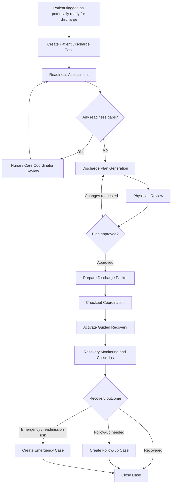
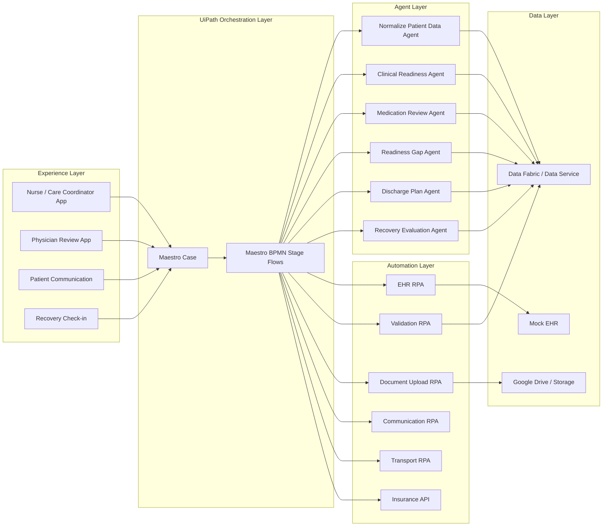

# CareBridgeAI
The Intelligent Patient Discharge Case System is a UiPath-powered healthcare automation solution designed to support providers and patients through one of the most important transitions in their care journey to help Patient recover soon.

# CareBridge AI

> **An intelligent patient discharge and recovery case system built with UiPath Maestro Case, Agent Builder, BPMN, RPA, Apps, and human-in-the-loop governance.**

CareBridge AI helps hospitals manage one of the most fragile moments in healthcare: the transition from hospital to home. It orchestrates the end-to-end discharge journey, from readiness assessment to discharge plan approval, checkout coordination, guided recovery, and closure, so patients leave the hospital with clarity, support, and reduced recovery stress.

This project was built for **UiPath AgentHack 2026** under **Track 1: UiPath Maestro Case**.

---

## Why CareBridge AI Matters

A patient discharge is not a simple checklist. It is a long-running, exception-heavy journey involving physicians, nurses, case managers, pharmacists, payers, transport teams, caregivers, documents, medications, follow-ups, and post-discharge recovery signals.

Today, discharge coordination is often fragmented across EHR notes, calls, emails, spreadsheets, portals, documents, and manual handoffs. That creates delays for hospitals and confusion for patients.

CareBridge AI turns discharge into a governed, transparent, agentic case lifecycle.

It makes sure:

- The care team sees readiness gaps early.
- AI agents summarize and recommend, but humans approve clinical decisions.
- Robots handle repetitive system work.
- Patients receive discharge instructions and recovery support.
- Recovery monitoring continues after the patient goes home.
- Emergency or worsening signals can create a linked escalation case.
- Every step remains visible, auditable, and governed inside UiPath Maestro Case.

The heart of the solution is simple:

> **The hospital should not only discharge the patient. It should help the patient recover safely after discharge.**

---

## The Problem

Hospital discharge is a high-risk transition point. Even when the doctor says the patient can go home, discharge may still be blocked by incomplete medication reconciliation, missing documentation, insurance authorization issues, unclear follow-up instructions, transport gaps, or patient/caregiver confusion.

After discharge, the burden often shifts to the patient. The patient is recovering, but now has to remember medications, warning signs, appointments, restrictions, and who to call when something feels wrong.

That recovery journey should not become stressful or administratively heavy.

CareBridge AI is designed to reduce that burden.

---

## Solution Overview

CareBridge AI creates one **Patient Discharge Case** per patient. The case acts as the single governing entity for data, stages, ownership, status, human approvals, agent outputs, escalations, and closure.

The solution combines:

| Capability | How it is used |
|---|---|
| **UiPath Maestro Case** | Governs the long-running patient discharge and recovery lifecycle. |
| **Maestro BPMN** | Runs deterministic stage flows such as case creation, readiness assessment, checkout, recovery, and closure. |
| **UiPath Agent Builder** | Performs judgment-heavy tasks such as readiness gap assessment, medication review, discharge plan drafting, and recovery evaluation. |
| **UiPath RPA** | Retrieves mock EHR data, validates patient records, sends communication, prepares packets, and coordinates transport. |
| **UiPath Apps / Action Center** | Keeps nurses, physicians, and care coordinators in control at approval and review points. |
| **Data Fabric / Data Service** | Stores patient, case, checklist, discharge plan, vitals, and recovery outcome data. |
| **Google Drive / Storage** | Stores generated discharge packet documents and patient artifacts. |
| **Integration/API layer** | Supports insurance snapshot checks, communication, and external data integration. |

---

## Why UiPath Maestro Case Is the Right Fit

Patient discharge is not a fixed linear process. Different patients take different paths:

- Some are ready with no gaps.
- Some need medication reconciliation.
- Some need insurance authorization.
- Some need transport coordination.
- Some need post-discharge recovery reminders.
- Some show worsening symptoms and need urgent escalation.
- Some recover successfully and can be closed.
- Some require a follow-up or readmission case.

This makes it a perfect use case for **agentic case management**.

CareBridge AI uses Maestro Case for the overall lifecycle and BPMN flows for structured stage execution. This gives the solution both flexibility and control.

---

## End-to-End Lifecycle



---

## Case Stages

| Stage | Purpose | Main UiPath Components |
|---|---|---|
| **1. Case Creation** | Create the discharge case when the patient is nearing discharge readiness. | Maestro Case, BPMN, RPA, API |
| **2. Readiness Assessment** | Validate patient data, documents, medication status, clinical readiness, and insurance/auth blockers. | BPMN, Agents, RPA, App/User Review |
| **3. Discharge Plan Generation** | Generate a structured discharge plan using patient data, readiness summary, and provider recommendations. | Agent Builder, BPMN, App/User Review, Google Drive |
| **4. Checkout Coordination** | Prepare the patient packet, send communication, coordinate transport, and complete checkout. | BPMN, RPA, Communication workflow |
| **5. Guided Recovery** | Activate post-discharge recovery support, reminders, check-ins, and recovery evaluation. | BPMN, Agents, timers, patient communication |
| **6. Recovery Closure** | Decide whether the patient recovered, needs follow-up, or requires emergency escalation. | BPMN, Agent, linked case creation |

---

## Digitized UiPath Components

| Component | Type | Purpose |
|---|---|---|
| `Maestro Case` | Maestro Case | Governing patient discharge case container. |
| `Create Discharge Case Record` | Maestro BPMN | Creates and initializes the discharge case record. |
| `RetrievePatientDataFromEHR` | RPA | Retrieves mock patient data from the EHR source. |
| `NormalizePatientData` | Agent | Normalizes patient information into a consistent structure. |
| `ValidatePatientData` | RPA | Validates required patient, admission, provider, and contact fields. |
| `VerifyInsuranceSnapshot` | API | Checks payer snapshot and basic insurance status. |
| `Read Patient Documents` | Maestro BPMN | Reads patient-related documents and artifacts. |
| `ValidateClinicalReadinessAgent` | Agent | Evaluates clinical readiness indicators. |
| `MedicationReviewAgent` | Agent | Reviews medication reconciliation status and medication gaps. |
| `Review Insurance and Auth` | RPA | Reviews payer or authorization dependency. |
| `MedicalGapReadinessAgent` | Agent | Identifies gaps blocking discharge readiness. |
| `GenerateReadinessSummary` | Agent | Summarizes readiness outcome and unresolved gaps. |
| `GenerateDraftDischargePlan` | Agent | Generates the draft discharge plan. |
| `Review Patient Plan` | App | Allows physician/human review and approval. |
| `PrepareDischargePacket_BPMN` | Maestro BPMN | Prepares the discharge packet. |
| `FetchDocumentAndUploadtoGDrive` | RPA | Uploads generated artifacts to Google Drive. |
| `SendCommunication` | RPA | Sends discharge communication to patient/caregiver. |
| `Co-ordinate Transport` | Maestro BPMN | Coordinates patient transportation. |
| `CompleteCheckout` | RPA | Completes the checkout process. |
| `ActivatePatientRecovery` | Maestro BPMN | Activates guided recovery support. |
| `SendRecoveryReminders` | Maestro BPMN | Sends medication, care, and follow-up reminders. |
| `CaptureCheckIn` | Maestro BPMN | Captures patient check-in responses. |
| `Review Recovery Outcome` | Maestro BPMN | Reviews recovery progress and outcome. |
| `CompleteClosure` | Maestro BPMN | Closes the discharge case with final outcome. |

---

## Agent Design

CareBridge AI uses narrow, purpose-built agents. Each agent has a focused role, structured inputs, structured outputs, and a clear escalation policy.

### 1. Normalize Patient Data Agent

**Purpose:** Converts raw patient JSON or EHR-style data into a clean, standardized structure.

**Output:**

```json
{
  "normalized": true,
  "patientId": "PAT-1002",
  "missingFields": [],
  "dataQualityNotes": []
}
```

---

### 2. Clinical Readiness Agent

**Purpose:** Reviews patient readiness indicators and determines whether any clinical blocker exists.

**Checks include:**

- Clinical stability
- Pending labs or consults
- Provider readiness
- Diagnosis-specific concerns
- Risk level

**Escalation:** Any unclear or high-risk clinical item is routed to human review.

---

### 3. Medication Review Agent

**Purpose:** Reviews medication reconciliation status and identifies medication-related discharge blockers.

**Checks include:**

- Medication reconciliation complete or pending
- New, changed, stopped medications
- Allergy conflicts
- High-risk medication education needs
- Pharmacy/access concerns

**Escalation:** Medication gaps are routed to nurse/pharmacy review.

---

### 4. Medical Gap Readiness Agent

**Purpose:** Consolidates patient data, clinical readiness, medication status, insurance/auth status, and document status into a readiness decision.

**Output:**

```json
{
  "readyForDischargePlanning": false,
  "riskLevel": "Medium",
  "gaps": [
    {
      "category": "Medication",
      "gap": "Medication reconciliation is not complete",
      "owner": "Pharmacy",
      "priority": "High"
    }
  ],
  "recommendation": "Pause discharge plan generation until medication reconciliation is reviewed."
}
```

---

### 5. Discharge Plan Agent

**Purpose:** Drafts a structured discharge plan based on approved patient data, readiness summary, provider recommendation, medication profile, and care instructions.

**Important design rule:**

> The agent can draft the plan, but it cannot finalize the plan. Physician approval is mandatory.

**Output includes:**

- Diagnosis summary
- Medication instructions
- Follow-up appointments
- Diet and activity guidance
- Warning signs
- Recovery reminders
- Transport or caregiver notes
- Patient-friendly instructions

---

### 6. Recovery Evaluation Agent

**Purpose:** Reviews patient check-ins and recovery indicators after discharge.

**Possible outcomes:**

| Outcome | Meaning | Case action |
|---|---|---|
| `Recovered` | Patient is doing well. | Close case. |
| `FollowUpNeeded` | Patient needs additional appointment or support. | Create linked follow-up case. |
| `EmergencyRisk` | Patient reports serious symptoms or worsening indicators. | Create emergency/readmission case and alert care team. |

---

## Human-in-the-Loop Governance

CareBridge AI intentionally keeps humans in control at critical clinical decision points.

| Decision Point | Human Role | Why it matters |
|---|---|---|
| Readiness gap review | Nurse / care coordinator | Gaps may affect patient safety or discharge timing. |
| Medication issue review | Nurse / pharmacy | Medication confusion is a major discharge risk. |
| Discharge plan approval | Physician / provider | AI should not finalize clinical discharge instructions. |
| Recovery escalation | Care team | Worsening symptoms require human clinical response. |

The solution follows this principle:

> **Agents recommend. Humans approve. Maestro governs. Robots execute.**

---

## Demo Personas

The project includes demo-ready seeded patient scenarios.

### Smooth Sam

A happy-path patient with complete information and no major discharge blockers.

**Demo value:** Shows end-to-end automation speed and clean case progression.

---

### Gap Gita

A medium-risk cardiology patient with a medication reconciliation gap.

**Demo value:** Shows readiness assessment, AI gap detection, human review, and loop-back before discharge planning.

---

### Critical Carl

A high-risk cardiology patient whose recovery signals indicate worsening condition.

**Demo value:** Shows the architectural wow moment: guided recovery detects risk, interrupts the case flow, creates a linked emergency/readmission case, and alerts the care team.

---

## Demo Script

1. Open the mock EHR and flag the patient as nearing discharge readiness.
2. Maestro creates a Patient Discharge Case.
3. RPA retrieves and validates patient data.
4. Agents review clinical readiness, medication reconciliation, and insurance/auth status.
5. For Gap Gita, the agent identifies a medication gap and sends it to human review.
6. Nurse resolves the gap.
7. Discharge Plan Agent drafts the discharge plan.
8. Physician reviews and approves the plan.
9. RPA prepares and stores the discharge packet.
10. Patient/caregiver communication is sent.
11. Transport is coordinated.
12. Guided Recovery begins after checkout.
13. Recovery check-ins and reminders continue.
14. For Critical Carl, a worsening signal triggers emergency escalation.
15. Maestro creates a linked emergency/readmission case.
16. The original discharge case closes with a documented outcome.

---

## Architecture



---

## Data Model

| Entity | Key Fields |
|---|---|
| `Patient` | PatientId, MRN, Name, Age, Sex, Ward, Bed, AdmissionDate, Diagnosis, Provider, RiskLevel, Phone |
| `InsuranceSnapshot` | PatientId, PlanName, PolicyNumber, GroupNumber, Copay, EffectiveDate, SubscriberName, Status |
| `ChecklistItem` | CaseId, ItemName, Status, Owner, Reason, ResolvedOn |
| `MedicationReview` | PatientId, Medication, Dose, Frequency, ReconciliationStatus, GapReason |
| `DischargeCase` | CaseId, PatientId, Stage, Status, RiskLevel, Outcome, CreatedOn, ClosedOn, LinkedCaseId |
| `DischargePlan` | PlanId, CaseId, Version, PlanJson, DocumentUrl, ApprovedBy, ApprovedOn |
| `RecoveryCheckIn` | PatientId, CaseId, Timestamp, Symptoms, PainLevel, MedicationTaken, ConcernFlag |
| `RecoveryOutcome` | CaseId, Outcome, Reason, NextAction, LinkedCaseId |

---

## Repository Structure

```text
carebridge-ai/
├── README.md
├── docs/
│   ├── architecture.md
│   ├── demo-script.md
│   ├── data-model.md
│   ├── agent-prompts.md
│   ├── setup-guide.md
│   └── screenshots/
├── uipath/
│   ├── maestro-case/
│   ├── bpmn-flows/
│   ├── agents/
│   ├── rpa-workflows/
│   ├── apps/
│   └── data-service/
├── mock-data/
│   ├── patients.json
│   ├── payer-snapshot.json
│   ├── clinical-notes/
│   └── recovery-checkins.json
├── sample-outputs/
│   ├── readiness-summary.json
│   ├── discharge-plan.json
│   ├── discharge-packet.pdf
│   └── recovery-outcome.json
└── coding-agent-evidence/
    ├── prompt-log.md
    ├── generated-components.md
    └── screenshots/
```

---

## How to Run the Demo

### Prerequisites

- UiPath Automation Cloud tenant
- UiPath Maestro enabled
- UiPath Agent Builder enabled
- UiPath Studio / Studio Web
- UiPath Apps
- Data Service or Data Fabric equivalent
- Google Drive connection or mock document storage
- Optional communication connector or mock communication workflow

### Setup Steps

1. Clone this repository.
2. Import the UiPath solution package into Automation Cloud.
3. Create or verify the Data Service entities listed in the data model.
4. Upload mock patient data from `mock-data/patients.json`.
5. Configure Orchestrator assets for environment-specific values.
6. Publish the RPA workflows.
7. Publish the Agent Builder agents.
8. Publish the Maestro BPMN flows.
9. Create the Maestro Case definition and attach the stage flows.
10. Open the Case App and select a demo patient.
11. Trigger the case creation process.
12. Follow the demo script for Smooth Sam, Gap Gita, or Critical Carl.

---

## Configuration

| Config Name | Description |
|---|---|
| `MockEHR_Source` | Location of patient source data. |
| `GoogleDrive_DischargeFolder` | Folder where discharge packets are stored. |
| `CareCoordinatorEmail` | Default escalation owner. |
| `PhysicianReviewerEmail` | Default discharge plan approver. |
| `CommunicationMode` | Live or mock communication mode. |
| `RecoveryReminderCadence` | Default reminder cadence for recovery support. |
| `EmergencyEscalationEnabled` | Enables emergency case creation path. |

---

## Sample Agent Output

```json
{
  "caseId": "CASE-PAT-1002-20260629",
  "patientId": "PAT-1002",
  "readinessDecision": "Not Ready",
  "riskLevel": "Medium",
  "gaps": [
    {
      "category": "Medication Reconciliation",
      "status": "Blocked",
      "reason": "Medication reconciliation is pending and must be reviewed before discharge plan approval.",
      "owner": "Pharmacy",
      "priority": "High"
    }
  ],
  "recommendedNextAction": "Route to nurse/pharmacy review before generating the discharge plan."
}
```

---

## What Makes This Project Different

CareBridge AI is not a chatbot placed on top of a workflow.

It is a governed enterprise case system where agents, robots, humans, and patient communications work together inside a transparent lifecycle.

### Key differentiators

- **Case-first architecture:** The patient discharge journey is modeled as a long-running case, not a brittle linear automation.
- **Human-in-the-loop by design:** Clinical decisions remain with nurses and physicians.
- **Agentic where it matters:** Agents handle summarization, gap detection, plan drafting, and recovery evaluation.
- **Automation where it is repeatable:** RPA handles EHR reads, validations, packet generation, communication, and transport coordination.
- **Recovery does not stop at discharge:** The case continues into guided recovery after the patient leaves the hospital.
- **Linked case escalation:** Follow-up or emergency cases can be created from recovery outcomes.
- **Audit by construction:** Every decision, review, gap, approval, and outcome is visible on the case timeline.

---

## Judging Alignment

| Judging Area | How CareBridge AI addresses it |
|---|---|
| **Business Impact** | Targets a real healthcare operational problem: safer discharge, fewer delays, clearer patient instructions, reduced recovery stress, and stronger post-discharge follow-up. |
| **Platform Usage** | Uses Maestro Case, BPMN, Agent Builder, RPA, Apps, API/integration, Data Service, and document storage together in one solution. |
| **Technical Execution** | Uses modular workflows, structured agent outputs, human gates, mockable integrations, clear data entities, and deterministic stage boundaries. |
| **Completeness** | Includes end-to-end case lifecycle, demo personas, mock data, agents, RPA workflows, Apps, documentation, and sample outputs. |
| **Creativity and Innovation** | Extends discharge automation beyond hospital checkout into guided recovery and emergency escalation. |
| **Presentation Strength** | Uses a simple emotional story: the patient should not feel abandoned after leaving the hospital. |
| **Bonus: Coding Agent Usage** | Documents how coding agents helped accelerate design, scaffolding, data validation logic, prompts, and README/documentation generation. |

---

## Coding Agent Usage

This project used AI-assisted development as part of the build process.

| Tool | Contribution |
|---|---|
| **OpenAI Codex / Coding Agent** | Assisted with workflow logic design, JSON validation patterns, mock data structure, JavaScript snippets, and README scaffolding. |
| **ChatGPT** | Assisted with solution architecture, agent prompts, documentation, demo story, judging strategy, and patient-centered narrative. |

### Evidence included

The `coding-agent-evidence/` folder should include:

- Prompt logs or exported conversations
- Screenshots of coding agent sessions
- Generated code snippets or workflow logic
- Explanation of where the generated outputs were integrated

The coding agent output is not only referenced. It is meaningfully integrated into:

- Patient JSON validation logic
- Email and communication templates
- Agent prompt design
- Mock data preparation
- README and documentation structure
- Demo script and judging alignment

---

## Security, Safety, and Governance

CareBridge AI is designed as a healthcare-safe demo pattern.

- No agent makes a final clinical decision.
- High-risk or uncertain outputs are escalated to a human.
- Physician approval is required before discharge plan finalization.
- Patient communication is based on approved plan content.
- Mock data is used for demonstration.
- Sensitive information should be stored only in governed systems.
- Agent outputs should be logged with case context and reviewed through the case timeline.

---

## Limitations

This hackathon version is a working proof of concept, not a production clinical system.

Current limitations:

- Uses mock EHR data instead of a live hospital EHR.
- Uses simulated insurance and authorization checks.
- Uses demo patient personas.
- Uses simplified recovery check-ins.
- Does not replace clinician judgment.
- Does not provide medical advice directly to patients.

---

## Future Enhancements

- Real EHR integration using HL7/FHIR APIs.
- Payer authorization integration.
- Real medication reconciliation integration.
- Patient portal integration.
- Multilingual discharge instructions.
- Wearable vitals integration.
- Predictive readmission risk scoring.
- Caregiver-specific communication workflows.
- Hospital command-center dashboard.
- Closed-loop follow-up appointment scheduling.

---

## Project Status

| Area | Status |
|---|---|
| Case lifecycle design | Complete |
| Maestro case plan | Complete |
| BPMN stages | Built for demo |
| Agent prompts | Built for demo |
| RPA workflows | Built for demo |
| Mock patient data | Complete |
| Demo personas | Complete |
| Documentation | Complete |
| Production readiness | Future enhancement |

---

## Team

Built for UiPath AgentHack 2026.

**Project:** CareBridge AI — Intelligent Patient Discharge and Recovery Case System  
**Primary builder:** Vino Livan Nadar  
**Category:** Track 1 — UiPath Maestro Case  
**Theme:** Healthcare, patient discharge, recovery coordination, agentic case management

---

## Closing Thought

A successful discharge is not the moment the patient leaves the hospital.

A successful discharge is when the patient reaches home, understands the plan, receives the right support, knows when to ask for help, and continues recovering without unnecessary stress.

CareBridge AI was built for that moment.
